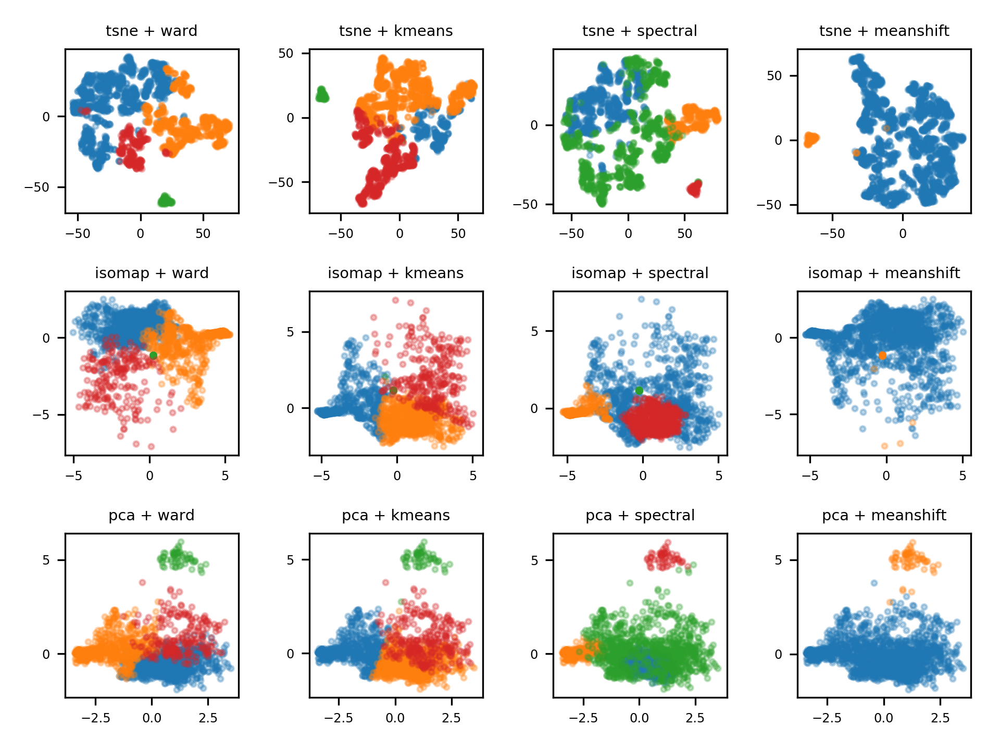

 

Authors: Valerie de Anda (1), Cesar Poot-Hernandez (2), Bruno Contreras-Moreira (3)

1. [Instituto de Ecologia](http://web.ecologia.unam.mx), UNAM, Mexico
2. [Instituto de Investigaciones Matematicas Aplicadas y en Sistemas](http://www.iimas.unam.mx), UNAM, Mexico
3. [Fundacion ARAID](http://www.araid.es) & [EEAD-CSIC](http://www.eead.csic.es), Zaragoza, Spain

# Documentation

Full  documentation is  available  at the folowing [README](https://eead-csic-compbio.github.io/metagenome_Pfam_score/READMEv1.html)   


# Basic usage

MEBS uses a few  command line options that can  be viewed by typing mebs.pl -h on the command line

```
perl mebs.pl -h 

  Program to compute MEBS for a set of genomic/metagenomic FASTA files in input folder.
  Version: v1.0

  usage: mebs.pl [options] 

   -help    Brief help message
   
   -input   Folder containing FASTA peptide files (.faa)                  (required)

   -type    Nature of input sequences, either 'genomic' or 'metagenomic'  (required)

   -fdr     Score cycles with False Discovery Rate 0.1 0.01 0.001 0.0001  (optional, default=0.01)

   -cycles  Show currently supported biogeochemical cycles
   
   -comp    Compute the metabolic completeness      
   
```


# UPDATES 
---


**/10/19/18: New script to cluster MEBS scores of your own  uknown bins or genomes with a dataset of 2,107 nr genomes from Refseq**. 

###  Usage

```
python3 scripts/F_MEBS_cluster.py -h
usage: F_MEBS_cluster.py [-h] [-k KPARAM] [-p {tsne,pca,isomap}]
                         [-c {ward,kmeans,meanshift,spectral}] [--all]
                         [--seed SEED] [-n {2,3}] [--dpi DPI]
                         filename

Creates a figure with the low dimention projection and clustering of the data
in a MEBS result file. The clustering is computed from the stadardized and
scaled original data, not with the dimensionaly reduced.
```





**10/18/18: The Iron cycle has been updated to include the metabolic completeness of the following pathways:**

1. [Fe(II) oxidation](https://metacyc.org/META/NEW-IMAGE?type=PATHWAY&object=PWY-6692)
2. [iron reduction and absorption](https://metacyc.org/META/NEW-IMAGE?type=PATHWAY&object=PWY-5934)

**10/18/18: The nitrogen cycle has been updated to include the metabolic completeness of the following pathways:**

[Nitrogen Pathways](https://eead-csic-compbio.github.io/metagenome_Pfam_score/nitrogen.html). See corresponding  mappping file [here](https://github.com/eead-csic-compbio/metagenome_Pfam_score/blob/master/cycles/nitrogen/pfam2kegg.tab) 

---

**10/05/18: The sulfur cycle has been updated to include the metabolic completeness of the following pathways:**

[Sulfur Pathways](https://eead-csic-compbio.github.io/metagenome_Pfam_score/sulfur.html) See the corresponding  mappping file [here](https://github.com/eead-csic-compbio/metagenome_Pfam_score/blob/master/cycles/sulfur/pfam2kegg.tab)   

Since the sulfur pathways described in [MEBS's manuscript](https://academic.oup.com/gigascience/article/6/11/gix096/4561660) were assembled from many pathways found in a variety of organisms, whose purpose is to provide an overview of the metabolic capabilities of entire ecosystems/metagenomic samples, we suggest the  above mentioned division that represents pathways from single organisms to  evaluate genomes/bins. 
Please note that the old file can be still used  for the analysis of metagenomic samples but it has been moved to the [mapping directory](https://github.com/eead-csic-compbio/metagenome_Pfam_score/blob/master/mapping/pfam2kegg.tab) 


---

**09/28/18:  The methane cycle has been updated to include the metabolic completeness of only 6 major pathways:**


1. coB/coM regeneration
2. methane oxidation 
3. methanogenesis
4. methanogenesis(methanol) 
5. methylamine degradation
6. mcrABC 

See the corresponding mapping file [here](https://github.com/eead-csic-compbio/metagenome_Pfam_score/blob/master/cycles/carbon/pfam2kegg.tab)   

---
