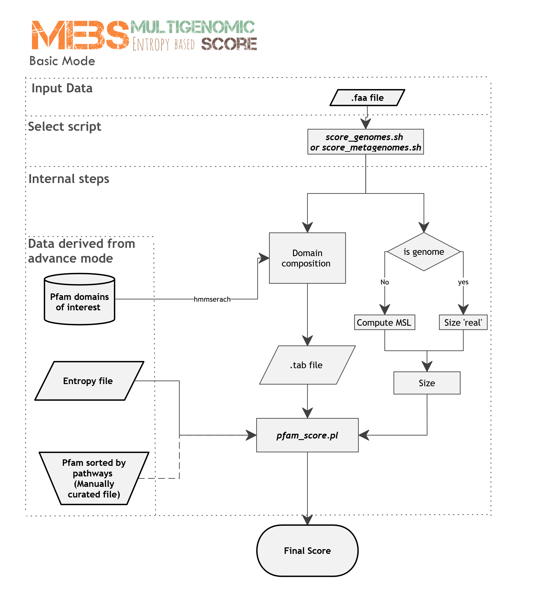

# Multigenomic Entropy-Based Score (MEBS)

Valerie de Anda (1), Cesar Poot-Hernandez (2), Bruno Contreras-Moreira (3)

1. [Instituto de Ecologia](http://web.ecologia.unam.mx), UNAM, Mexico
2. [Instituto de Investigaciones Matematicas Aplicadas y en Sistemas](http://www.iimas.unam.mx), UNAM, Mexico
3. [Fundacion ARAID](http://www.araid.es) & [EEAD-CSIC](http://www.eead.csic.es), Zaragoza, Spain

--

This computational pipeline was designed to evaluate the importance of global biogeochemical cycles 
or major metabolic pathways in multigenomic scale. 
It has been thoroughly tested with the Sulfur cycle (see [benchmark](./scripts/MEBS.figures.ipynb)) 
but also with some other cycles. The scripts are written in bash, perl5 and python3 and have been tested under Linux.

The following papers describe this pipeline:

+ De Anda V, Zapata-Penasco I, Poot Hernandez AC, Fruns LE, Contreras Moreira B, Souza V (2017) MEBS, a software platform to evaluate large (meta)genomic collections according to their metabolic machinery: unraveling the sulfur cycle. [doi:10.1093/gigascience/gigascience/gix096/4561660](https://academic.oup.com/gigascience/advance-article/doi/10.1093/gigascience/gix096/4561660)
<!--[doi:10.1101/191288 ](https://www.biorxiv.org/content/early/2017/09/20/191288)-->

+ Other cycles: in preparation 

# Scoring your data (Sulfur cycle). 
# Basic Mode 

Scripts [score_genomes.sh](./score_genomes.sh) and [score_metagenomes.sh](./score_metagenomes.sh) are provided
so that users can virtually avoid reading the manual and score their own genomes/metagenomes in terms of their
Sulfur cycle metabolic machinery. All that is required is a directory containing peptide FASTA files of
encoded proteins/fragments with **.faa** extension.
Note that hmmsearch must be installed as well (see below).
Examples of use would be:

$ ./score_genomes.sh test_genomes

or 

$ ./score_metagenomes.sh test_metagenomes

# Train your own classifier for any cycle/pathway 
# Advanced Mode 

For more advanced uses a [manual](manual.v1.pdf) is provided. The required input data are:

1. FASTA file with peptides sequences of proteins involved in the cycle/pathway of interest.
2. List of RefSeq accesions of (curated) genomes known to be involved in the cycle/pathway of interest.

These inputs are processed in order to train a classifier which internally uses [Pfam](http://pfam.xfam.org) domains.

As seen above, genomes or metagenomes provided by the user can then be scored with the trained classifier.
Once a classifier has been trained, such as the Sulfur cycle, steps 1 and 3 can be skipped. 

# Dependencies

The following external packages are required by the pipeline.
Interproscan and hmmsearch are needed in order to annotate Pfam domains within peptide sequences. 
The rest of packages are needed to run the full pipeline, which comprises four steps. 

1. [Interproscan](https://www.ebi.ac.uk/interpro/interproscan.htm}{Interproscan)
2. [Hmmsearch](http://hmmer.org)
3. [Python3](https://www.python.org/downloads)
4. [Matplotlib 1.4 or greater](http://matplotlib.org/users/installing.html#most-platforms-scientific-python-distributions) 
5. [Numpy](https://docs.scipy.org/doc/numpy-1.10.0/user/install.html)
6. [Pandas](http://pandas.pydata.org/pandas-docs/stable/install.html)
7. [Scikit-learn](http://scikit-learn.org/stable/install.html)
8. [Jupyter-notebook](http://jupyter.org}{Jupyter-notebook)
9. [MPL_toolkits](http://matplotlib.org/1.4.3/mpl_toolkits/index.html)
