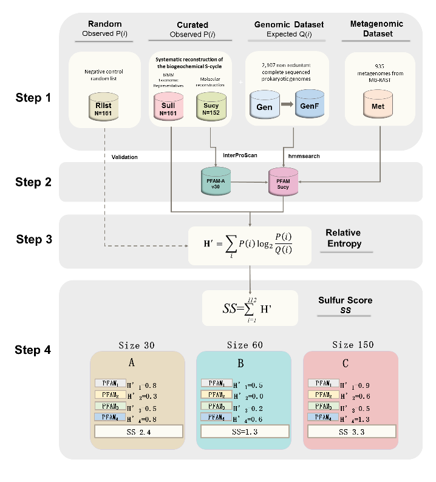

# Multigenomic Entropy-Based Score (MEBS)

Valerie de Anda (1), Cesar Poot-Hernandez (2), Bruno Contreras-Moreira (3)

1. [Instituto de Ecologia](http://web.ecologia.unam.mx), UNAM, Mexico
2. [Instituto de Investigaciones Matematicas Aplicadas y en Sistemas](http://www.iimas.unam.mx), UNAM, Mexico
3. [Fundacion ARAID](http://www.araid.es) & [EEAD-CSIC](http://www.eead.csic.es), Zaragoza, Spain

--

This computational pipeline was designed to evaluate the importance of global biogeochemical cycles 
or major metabolic pathways in multigenomic scale. 
It has been thoroughly tested with the Sulfur cycle (see [benchmark](./scripts/MEBS.figures.ipynb)) 
but also with some other cycles (papers in preparation). 
The scripts are written in bash, perl5 and python3 and have been tested under Linux.

# Scoring your data (Sulfur cycle)

Scripts [score_genomes.sh](./score_genomes.sh) and [score_metagenomes.sh](./score_metagenomes.sh) are provided
so that users can virtually avoid reading the manual and score their own genomes/metagenomes in terms of their
Sulfur cycle metabolic machinery. All that is required is a directory containing peptide FASTA files of
encoded proteins/fragments with **.faa** extension. Examples of use would be:

$ ./score_genomes.sh test_genomes

or 

$ ./score_metagenomes.sh test_metagenomes

# Train your own classifier for any cycle/pathway 

For more advanced uses an extensive [manual](./manual/manualv1.pdf) is provided. The required input data are:

1. FASTA file with peptides sequences of proteins involved in the cycle/pathway of interest.
2. List of RefSeq accesions of (curated) genomes known to be involved in the cycle/pathway of interest.

These inputs are processed in order to train a classifier which internally uses [Pfam](http://pfam.xfam.org) domains.

As seen above, genomes or metagenomes provided by the user can then be scored with the trained classifier.
Once a classifier has been trained, such as the Sulfur cycle, steps 1 and 3 can be skipped. 

<!--
Falta figura con leyenda y talvez ligas a las 4 etapas en el manual

STAGE 1. Compilation of datasets and databases 

STAGE 2. Annotating protein domains

STAGE 3. Estimating relative entropy of protein domains

STAGE 4. Sulfur Score (SS) and interpretation
 -->
