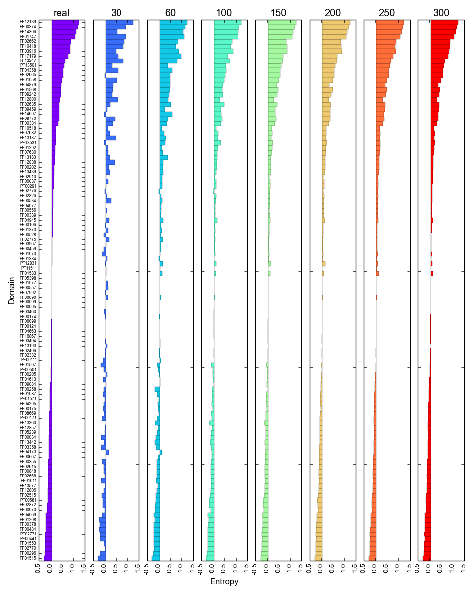
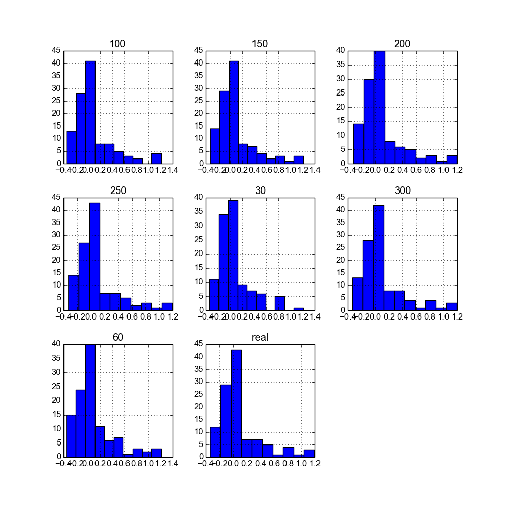
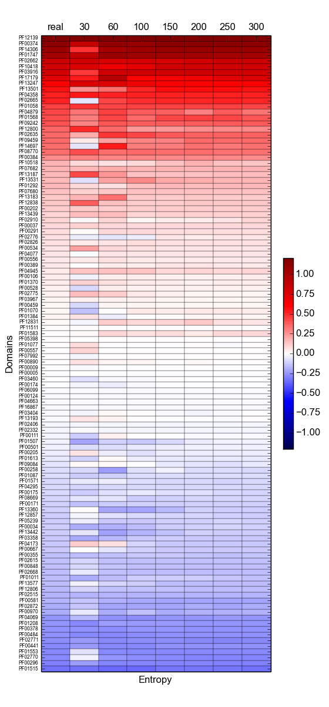
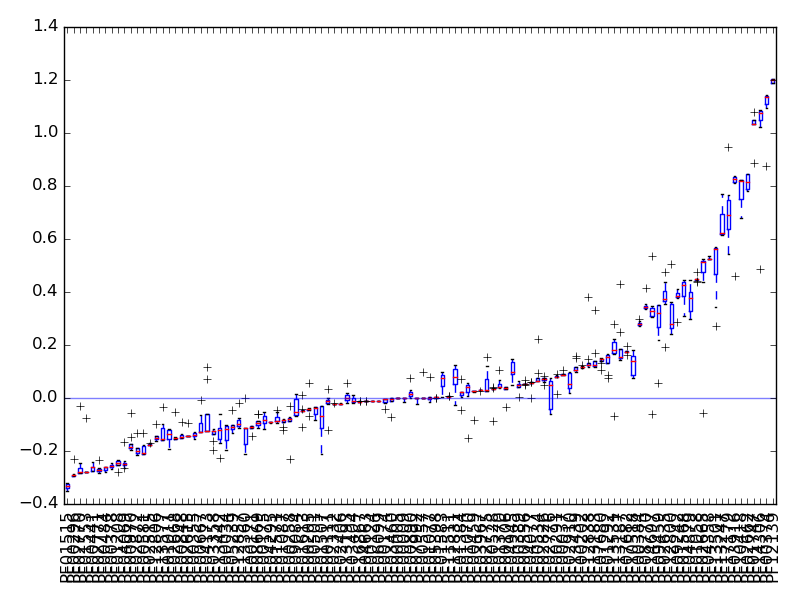
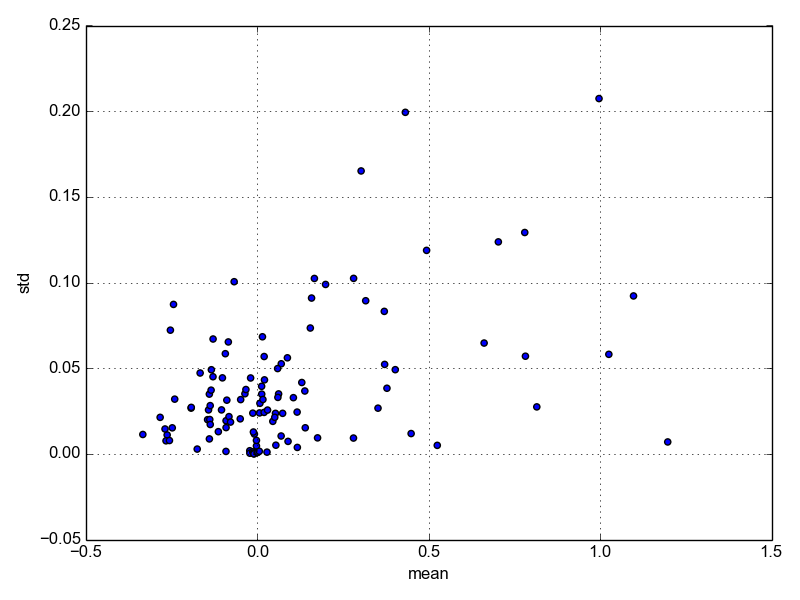

#STAGE 3. Estimating the relative entropy 

We used a derivative of the Kullback-Leibler divergenc (Kullback and Leibler, 1951)—also known as relative entropy H’(i)—to measure the difference between two probability distributions P and Q (Eq. 1). In this context, P(i) represents the total number of occurrences of protein family i in sulfur-related genomes (observed frequency), while Q(i) represents the total number of occurrences of that family in the genomic dataset (expected frequency). H’, in bits, captures the extent to which a family informs specifically about sulfur metabolism. H’ values that are close to 1 correspond to the most informative families (enriched among sulfur-related genomes), whereas low H’ values (close to zero) describe non-informative families. Negative values correspond to protein families observed less than expected

H'= P(i)log2 (aP(i)/Q(i))


###Requirements to compute relative entropies


 1. Aa hmmsearch TSV outfile with the results of scanning a collection of Pfam domais against
 a large set of (non-redundant) genomes (output from hmmsearch in the omic datasets )
 2. A list of selected accessions of genomes interest to compute entropy (see input_data/suli.nr25122016.txt)
 3. An optional list of RefSeq assembly annotations to print scientific names instead of accession codes (see /data/genomic_dataset/assembly_refseq.nr2016.tx)

 Output:
 1. A matrix of occurrence of Pfam domains across genomes
 2. Entropy estimates of each scanned Pfam domain with respect to the selected accessions

###Computing the relative entropy in the genomic and genomic fragmented datasets 
```{r,eval=FALSE}

#perl  ../scripts/entropy.pl : usage: ../scripts/entropy.pl <pfam_hmmsearch.tab> <accession list (ie Suli)> <RefSeq list, optional>

cd data
#Genomic dataset 
perl scripts/entropy.pl data/genomic_dataset/genomes_refseq_nr_22122016.1.faa.out.hmmsearch.tab input_data/suli.nr25122016.txt data/genomic_dataset/assembly_refseq.nr2016.txt  > GENOMES_NCBI_nr_28122016_size0_cover0.faa.pf.tab.csv
#Genomic fragmented dataset (genomic fragmented files are not provided, make sure you read Stage1.Rmd 

for i in data/genomic_fragmented/*.tab ; do perl scripts/entropy.pl $i input_data/suli.nr25122016.txt data/genomic_dataset/assembly_refseq.nr2016.txt > $i.csv 

mkdir entropies_matrix
mv *.csv entropies_matrix

```
###Plot relative entropies
In order to plot the results of the entropy.pl scripts, use the following scripts 

1. extract_entropies.py: This scripts requieres all the matrix containing the relative entropies computed in the genomic and genomic fragemnted dataset (sizes 30, 60, 100, 150, 200, 250, 300). The matrix are  are located in entropies_matrix/ directory. The scripts  returns a tabular list of the entropies. Make sure that the names of the matrix in csv format follow this pattern '_size([0-9]+)_', otherwise the script cannot be computed. Besides all the files need to have the same number of domains (profiles) in the same column order this script assumes that these considerations are true, so it cannot find errors in the input files format. Make sure that you have installed pandas module  http://pandas.pydata.org/pandas-docs/stable/install.html


```{r,eval=FALSE}
python ../scripts/extract_entropies.py entropies_matrix/

#The latter script will generate the following text file entropies_matrix__entropies.tab

#        real    30      60      100     150     200     250     300
#PF00005 -0.001  0.001   -0.001  -0.001  -0.001  -0.001  -0.001  -0.001
#PF00009 -0.001  -0.014  -0.001  -0.001  -0.001  -0.001  -0.001  -0.001
#PF00034 -0.119  -0.195  -0.183  -0.153  -0.115  -0.106  -0.101  -0.107
```


Then, visualizate the results of entropies_matrix_entropies.tab with  the script barplots.py

```{r,eval=FALSE}


python3 ../scripts/plot_entropy.py entropies_matrix_entropies.tab

```
The above command will generate 5 different plots of the entropies 









#Random test 
Due to its nature, H’ might be biased by the number of sequenced sulfur microorganisms (SuLi). For this reason, we recalculated H’, this time substituting SuLy with equally sized lists of random genomes (Rlist). If there really was no such bias, then we could expect to obtain low-informative Pfam domains during the random test. 
	Using these procedures, we evaluated the variation of relative entropy of each Pfam domain in order to short-list those that could be used as markers in metagenomic datasets, regardless of average length, and to generate a measure to be used as a way to compare the importance of sulfur metabolisms in metagenomes derived from any environment

